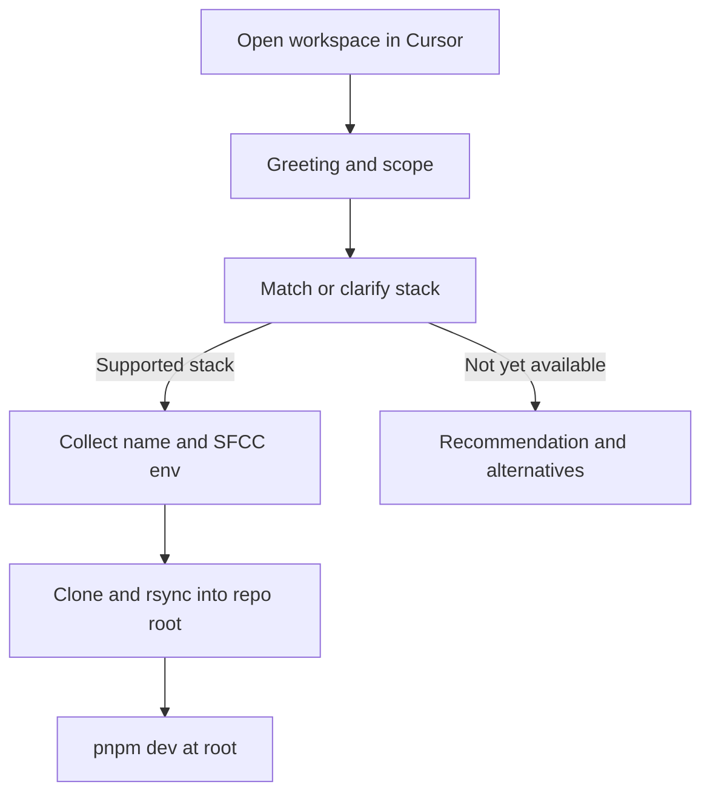

# Agentized commerce bootstrap (“Lothar”)

This document describes the **conversational** bootstrap experience for Cursor. Bootstrap is driven by **Cursor rules**; the agent runs terminal commands and writes project files into the **current workspace root** — there is no separate CLI package and no external output folder.

**Phase A (implemented):** Lothar runs in **Cursor Agent/Chat** via two opt-in rules:

- [`.cursor/rules/lothar.mdc`](../.cursor/rules/lothar.mdc) — persona, greeting, capability matrix
- [`.cursor/rules/lothar-bootstrap.mdc`](../.cursor/rules/lothar-bootstrap.mdc) — in-place collection, `git clone`, `rsync`, `pnpm install`, `.env.local`, `accelerator.manifest.json`

Related docs: [BOOTSTRAP.md](./BOOTSTRAP.md) (env vars and post-setup), [README.md](./README.md) (how to start), [PLAN.md](./PLAN.md) (roadmap).

### How to start (Cursor)

1. Open this repo in Cursor (it becomes your storefront after bootstrap).
2. Open **Agent** (or Chat).
3. **Enable both rules** for this conversation (@ → Rules → **Lothar** and **Lothar Bootstrap**). Other chats can stay normal without Lothar.
4. Say you want to bootstrap (e.g. “bootstrap my store”).
5. When your goal is **B2C + Next.js**, Lothar asks for project name and SFCC env in **chat**, then **runs** in-place scaffold steps in the terminal (you do not run bootstrap yourself).

---

## North star

A user opens one workspace and stays there: same chat, same file tree, same terminal. **Lothar** greets them, collects SFCC details, and merges the Next.js + SFCC template into the repo root while preserving `.cursor/rules/` and `lothar-docs/`.

The value over “just `git clone`” is **conversation**: explaining prerequisites, env vars, SFCC setup links, and **honest boundaries** about what is automated versus manual — without forcing a new Cursor window.

---

## Capability matrix (v0 — be explicit)

| User intent (examples) | Executable today? | What happens |
| ---------------------- | ----------------- | ------------ |
| SFCC **B2C** + **Next.js** storefront | **Yes** | Agent follows [lothar-bootstrap.mdc](../.cursor/rules/lothar-bootstrap.mdc): clone template, `rsync` into workspace root, `pnpm install`, `.env.local`, `accelerator.manifest.json`. |
| B2B Commerce, **React**-only SPA, other frameworks, non-SFCC backends | **No** | Lothar **acknowledges**, summarizes constraints, and offers alternatives or roadmap notes. |

Only **sfcc-b2c** + **nextjs** is scaffolded today. Everything else is **discover + educate** until new templates exist.

---

## Surfaces and hosts (future)

An agent here is **a model + instructions + terminal access**. Phase A uses **only** the Cursor project rules above. Later hosts could include:

- **IDE with chat** (other editors) — reuse rule text as a prompt or skill.
- **MCP server** — expose tools such as “run bootstrap” / “explain env”.
- **Headless automation** — a `scripts/bootstrap.sh` mirroring [lothar-bootstrap.mdc](../.cursor/rules/lothar-bootstrap.mdc) for CI (not in repo today).

Portability strategy: ship **one prompt/spec** (rules + this doc) and **one set of shell/file steps** (embedded in the bootstrap rule). Swap the host, not the in-place merge sequence.

---

## Rules vs execution

| Layer | Location | Role |
| ----- | -------- | ---- |
| **Persona** | [lothar.mdc](../.cursor/rules/lothar.mdc) | Greeting, capability matrix, in-place expectation |
| **Execution** | [lothar-bootstrap.mdc](../.cursor/rules/lothar-bootstrap.mdc) | Chat collection, clone + `rsync` to root, write `.env.local` and manifest |

Both rules use `alwaysApply: false`. Enable them only when bootstrapping.

Preserves across bootstrap: `.cursor/rules/`, `lothar-docs/` (including [README.md](./README.md)).

---

## Conversation flow

---

## Future: natural language to recommendation

**Goal:** The user describes an ambiguous project; the agent **extracts constraints**, **maps** them to a **template ID** when one exists, and only then proposes generation.

Suggested practices:

- Maintain a small **intent taxonomy** (tags) aligned with manifest `commerce.platform` / `frontend.framework`.
- Return **confidence** and **follow-up questions** before running anything destructive.
- When no template fits, output a structured “gap” list.

### Manifest extensions (future-friendly)

[accelerator.manifest.json](./BOOTSTRAP.md#manifest-file) today includes `commerce`, `frontend`, `sandbox`, `project`, and `agents`. Optional additive fields could include `userGoalSummary`, `matchedTemplate`, `unsupportedRequirements`.

Secrets stay in `.env.local` only; the manifest remains non-secret.

---

## Phasing

| Phase | Focus |
| ----- | ----- |
| **A** | **Done:** [lothar.mdc](../.cursor/rules/lothar.mdc) + [lothar-bootstrap.mdc](../.cursor/rules/lothar-bootstrap.mdc); in-place rules-only bootstrap (**B2C + Next.js**). |
| **B** | Intent taxonomy, richer “coming soon” messaging. |
| **C** | Additional templates; extend manifest schema in the bootstrap rule. |

**Note:** `packages/accelerator-cli` was removed in favor of rules-only bootstrap. Historical CLI design is documented in [PLAN.md](./PLAN.md).

---

This doc is maintained at [lothar-docs/AGENTPLAN.md](./AGENTPLAN.md).
