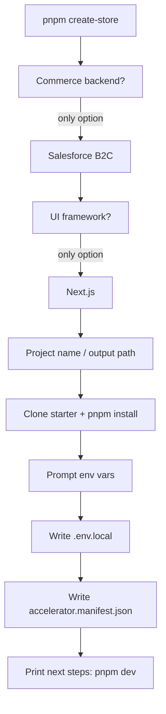

# Commerce Accelerator — Bootstrap (Phase 1)

> **Superseded (2026):** Bootstrap is now **rules-only, in-place** via [lothar.mdc](../.cursor/rules/lothar.mdc) and [lothar-bootstrap.mdc](../.cursor/rules/lothar-bootstrap.mdc). The template merges into the workspace root (same Cursor window/chat). `packages/accelerator-cli` and `pnpm create-store` were removed. See [AGENTPLAN.md](./AGENTPLAN.md) for the current model. This doc remains as historical Phase 1 design.

**Scope:** Bootstrap only. No specialist agents, no SCAPI validation in v1 unless time permits.

**Includes:** `accelerator.manifest.json` — lightweight project passport written at bootstrap so future agents (catalog, design, style, features) can read stack + progress without re-prompting.

**Deliverables when executed:**

| File | Purpose |
|------|---------|
| [`lothar-docs/BOOTSTRAP.md`](./BOOTSTRAP.md) | **Minimal** doc — CLI flow, env vars, manifest, how to run |
| [`lothar-docs/COMMERCE_ACCELERATOR.md`](./COMMERCE_ACCELERATOR.md) | Deferred — full multi-agent architecture |
| [`packages/accelerator-cli/`](packages/accelerator-cli/) | Interactive terminal bootstrap |

---

## What the user runs

```bash
# From next-pwa repo (during dev)
pnpm create-store

# Or after publish
npx @vercel/commerce-accelerator
```

One command. Interactive terminal. No Cursor agent required for v1.

---

## Terminal flow



### Prompt 1 — Commerce backend

```
? Which commerce backend will you use?
  ❯ Salesforce B2C (SFCC)
```

Single option pre-selected. Store as `sfcc-b2c`.

### Prompt 2 — UI framework

```
? Which UI framework will you use?
  ❯ Next.js
```

Single option. Store as `nextjs`.

### Prompt 3 — Project location

```
? Project name (folder name): my-store
? Where should we create it? ./my-store
```

Default: `./<project-name>` relative to cwd.

### Step 4 — Scaffold starter

**Template:** [`vercel-partner-solutions/nextjs-salesforce-commerce-cloud`](https://github.com/vercel-partner-solutions/nextjs-salesforce-commerce-cloud)

**Mechanism (v1):** `git clone --depth 1` into target path, remove `.git`, run `pnpm install`.

**Local dev alternative:** Copy from bundled [`nextjs-salesforce-commerce-cloud/`](nextjs-salesforce-commerce-cloud/) when running inside this monorepo.

### Prompt 5 — Environment variables

Mirror [`.env.example`](nextjs-salesforce-commerce-cloud/.env.example):

| Variable | Prompt hint |
|----------|-------------|
| `SITE_NAME` | Store display name (default: project name) |
| `SFCC_ORGANIZATIONID` | e.g. `f_ecom_xxxx_xxx` |
| `SFCC_SHORTCODE` | Instance short code |
| `SFCC_SITEID` | Default `RefArch` |
| `SFCC_CLIENT_ID` | SLAS API client ID |
| `SFCC_SECRET` | SLAS client secret (masked input) |
| `SFCC_REVALIDATION_SECRET` | Random string (offer to auto-generate) |
| `COMPANY_NAME` | Optional branding |
| `NEXT_PUBLIC_VERCEL_URL` | Default `http://localhost:3000` |

Write to `<project>/.env.local`. **Secrets stay here only** — never copied into the manifest.

### Step 6 — Write manifest

After env prompts, write `<project>/accelerator.manifest.json`.

**Bootstrap-only schema (v1):**

```json
{
  "version": "1",
  "createdAt": "2026-05-19T12:00:00.000Z",
  "commerce": {
    "platform": "sfcc-b2c",
    "siteId": "RefArch"
  },
  "frontend": {
    "framework": "nextjs",
    "template": "nextjs-salesforce-commerce-cloud",
    "templateSource": "github:vercel-partner-solutions/nextjs-salesforce-commerce-cloud"
  },
  "sandbox": {
    "organizationId": "f_ecom_xxxx_xxx",
    "shortCode": "000123"
  },
  "project": {
    "name": "my-store"
  },
  "agents": {
    "bootstrap": {
      "status": "complete",
      "completedAt": "2026-05-19T12:00:00.000Z"
    },
    "catalog": { "status": "pending" },
    "design": { "status": "pending" },
    "style": { "status": "pending" },
    "features": { "status": "pending", "requested": [] }
  }
}
```

| Field | Source | Notes |
|-------|--------|-------|
| `commerce.siteId` | `SFCC_SITEID` prompt | Non-secret |
| `sandbox.organizationId`, `sandbox.shortCode` | env prompts | Non-secret identifiers |
| `agents.bootstrap` | CLI sets `complete` on success | |
| `agents.*.status` | All others `pending` | Ready for Phase 2 agents |
| **Not in manifest** | `SFCC_SECRET`, `SFCC_CLIENT_ID`, revalidation secret | `.env.local` only |

Add `accelerator.manifest.json` to generated project `.gitignore` recommendation in BOOTSTRAP.md (optional commit — team choice; if committed, still no secrets).

### Done message

```
✓ Created my-store
✓ Wrote .env.local
✓ Wrote accelerator.manifest.json

Next steps:
  cd my-store
  pnpm dev
```

---

## Minimal repo layout (Phase 1)

```
next-pwa/
├── lothar-docs/
│   └── BOOTSTRAP.md
├── packages/
│   └── accelerator-cli/
│       ├── src/
│       │   ├── index.ts
│       │   ├── prompts.ts
│       │   ├── scaffold.ts
│       │   ├── env.ts
│       │   └── manifest.ts      # build + write manifest from prompts
│       └── ...
├── nextjs-salesforce-commerce-cloud/
└── package.json
```

No `accelerator-core`, no `agents/` skills yet — manifest is the hook for Phase 2.

---

## Why manifest in Phase 1

- **Documents intent** in the repo from day one (what backend, what template).
- **Future agents** read one file instead of inferring from folder structure.
- **Low cost** — ~30 lines of JSON, written once by CLI.
- **No secrets** — same split as full design: manifest = metadata, `.env.local` = credentials.

---

## CLI implementation choices

| Decision | Choice | Rationale |
|----------|--------|-----------|
| Interface | Terminal only | User request |
| Prompt library | `@inquirer/prompts` | Masked password for `SFCC_SECRET` |
| State file | `accelerator.manifest.json` | User wants it from bootstrap |
| Secrets | `.env.local` only | Never in manifest |
| Package manager | `pnpm` | Matches starter |

---

## `lothar-docs/BOOTSTRAP.md` outline

1. Purpose
2. Prerequisites (Node 20+, pnpm, git)
3. `pnpm create-store`
4. Prompts + env table
5. **Manifest file** — schema, what's stored vs `.env.local`
6. `pnpm dev` + SFCC SLAS docs
7. What's next (future agents read manifest)

---

## Deferred (not Phase 1)

- Catalog, Design, Style, Features agents (they will **update** manifest `agents.*.status`)
- SCAPI validate / `validateEnvironmentVariables` wiring
- Cursor Skills
- Full [`lothar-docs/COMMERCE_ACCELERATOR.md`](./COMMERCE_ACCELERATOR.md)

---

## Success criteria (Phase 1)

- CLI → single-option prompts → new project folder
- `.env.local` populated from interactive prompts
- `accelerator.manifest.json` present with `bootstrap: complete` and other agents `pending`
- `cd <project> && pnpm dev` works without manual env editing
