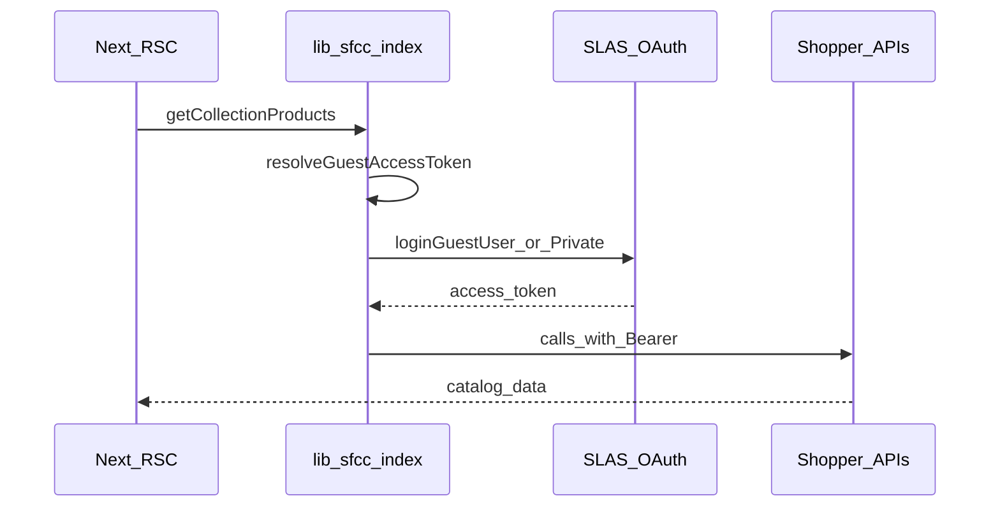

# SLAS authentication (Next.js storefront)

How this repo connects to a live **Salesforce B2C Commerce** sandbox using **SLAS** (Shopper Login and API Access Service) and the **Shopper APIs**.

Implementation lives in [`lib/sfcc/index.ts`](../lib/sfcc/index.ts). Env vars are in [`.env.example`](../.env.example) and [`.env.local`](../.env.local) (never commit `.env.local`).

For local development without a sandbox, see [MOCK-MODE.md](./MOCK-MODE.md). For general bootstrap env vars, see [BOOTSTRAP.md](./BOOTSTRAP.md).

## How this differs from PWA Kit

| | PWA Kit (your other project) | This Next.js template |
|--|------------------------------|------------------------|
| API path | Proxied (`/mobify/proxy/api` → `kv7kzm78.api.commercecloud.salesforce.com`) | Direct SCAPI from the Next server |
| Auth | SDK + proxy; often **public** SLAS + PKCE | Same SLAS clients, but **you** wire env + redirect URI |
| Hybrid Auth | Optional `dwsid` + SLAS sync for SFRA/SiteGenesis | **Not supported** — SLAS guest token only |
| OCAPI | May proxy to BM host (`zzrd-042.dx.commercecloud.salesforce.com`) | **Not used** |

Same sandbox identifiers usually work in both projects; the **login flow and hosting** are different.

## Request flow



1. A page or layout calls an export in `lib/sfcc` (e.g. `getCollectionProducts`).
2. **`resolveGuestAccessToken()`** returns a bearer token (cookie, or new SLAS login).
3. Shopper API clients (`ShopperProducts`, `ShopperSearch`, `ShopperBaskets`, …) send `Authorization: Bearer <token>`.

## Public vs private SLAS client

| Type | When to use | Env | SDK helper |
|------|-------------|-----|------------|
| **Public** | PWA Kit default; no client secret | `SFCC_SLAS_PUBLIC="true"`, `SFCC_SECRET=""` | `helpers.loginGuestUser` (PKCE) |
| **Private** | Server-side app with a secret | `SFCC_SLAS_PUBLIC="false"`, `SFCC_SECRET="<secret>"` | `helpers.loginGuestUserPrivate` |

**Auto-detect** (when `SFCC_SLAS_PUBLIC` is unset): public mode if `SFCC_SECRET` is empty or still the placeholder `your-secret`. See `usePublicSlasClient()` in [`lib/sfcc/index.ts`](../lib/sfcc/index.ts).

**Public client requirements**

- A **redirect URI** registered on the SLAS client in Account Manager (must match env exactly).
- No `SFCC_SECRET` — do not paste an integration/admin client password from a `client_credentials` curl; that is a different client and grant type.

**Private client requirements**

- `SFCC_CLIENT_ID` + `SFCC_SECRET` pair from Account Manager.
- Secret must never be committed.

Official reference: [Authorization for Shopper APIs](https://developer.salesforce.com/docs/commerce/commerce-api/guide/authorization-for-shopper-apis.html).

## Environment variables

| Variable | Description |
|----------|-------------|
| `SFCC_USE_MOCK` | `"true"` skips SLAS and uses local mock catalog/cart. `"false"` for live sandbox. |
| `SFCC_SLAS_PUBLIC` | `"true"` = public SLAS (PKCE). `"false"` = private (secret required). |
| `SFCC_SLAS_REDIRECT_URI` | Redirect URI for public guest login (e.g. `http://localhost:3000/callback`). Must be allowlisted on the SLAS client. |
| `SFCC_CLIENT_ID` | SLAS API client ID |
| `SFCC_SECRET` | SLAS client secret (private clients only; leave empty for public) |
| `SFCC_ORGANIZATIONID` | Org ID, e.g. `f_ecom_zzrd_042` |
| `SFCC_SHORTCODE` | Commerce API short code (e.g. `kv7kzm78`) — **not** the Business Manager hostname |
| `SFCC_SITEID` | Site ID in Business Manager (e.g. `TestSite` or `RefArch`) |
| `NEXT_PUBLIC_VERCEL_URL` | Public site URL; used as fallback when building redirect URI |
| `SITE_NAME`, `COMPANY_NAME` | Display branding only |
| `SFCC_REVALIDATION_SECRET` | On-demand cache revalidation (unrelated to SLAS login) |

### Example: public SLAS (PWA Kit–style sandbox)

```env
SFCC_USE_MOCK="false"
SFCC_SLAS_PUBLIC="true"
SFCC_SLAS_REDIRECT_URI="http://localhost:3000/callback"
NEXT_PUBLIC_VERCEL_URL="http://localhost:3000"
SFCC_CLIENT_ID="b7289d7b-236e-46ca-912c-2aee6b36ccda"
SFCC_ORGANIZATIONID="f_ecom_zzrd_042"
SFCC_SECRET=""
SFCC_SHORTCODE="kv7kzm78"
SFCC_SITEID="TestSite"
```

### PWA Kit `commerceAPI.parameters` → this repo

| PWA Kit (`config/default.js`) | This repo |
|-------------------------------|-----------|
| `clientId` | `SFCC_CLIENT_ID` |
| `organizationId` | `SFCC_ORGANIZATIONID` |
| `shortCode` | `SFCC_SHORTCODE` |
| `siteId` | `SFCC_SITEID` |

**Common mistake:** using the Business Manager URL host (`zzrd-042`) as `SFCC_SHORTCODE`. The API short code is the subdomain before `.api.commercecloud.salesforce.com` (e.g. `kv7kzm78`).

## SLAS client setup (Account Manager)

1. Use the **shopper** SLAS client your composable storefront already uses (e.g. from PWA `commerceAPI.parameters.clientId`).
2. For **public** clients, add an allowed redirect URI:
   - Local: `http://localhost:3000/callback`
   - Production: `https://<your-domain>/callback` (and set `SFCC_SLAS_REDIRECT_URI` + `NEXT_PUBLIC_VERCEL_URL` accordingly).
3. Ensure the client is enabled for **Shopper API** scopes needed by this template (products, search, baskets, orders for checkout).

After changing env, **restart** `pnpm dev` so Next.js reloads `.env.local`.

## Implementation in this repo

### Token resolution

- **`resolveGuestAccessToken()`** — Prefer `guest_token` cookie; otherwise one SLAS login per request (`guestAccessTokenInflight` dedupes parallel calls).
- **`fetchGuestUserAuthToken()`** — Public: `loginGuestUser` + `getSlasRedirectUri()`. Private: `loginGuestUserPrivate` + `SFCC_SECRET`.
- **`getGuestUserConfig(token?)`** — Builds SDK config with `Authorization` header.

Cart flows may pass an existing `guest_token` from cookies; catalog flows resolve a token in the export wrapper (see below).

### `"use cache"` and dynamic auth

Next.js **forbids** `cookies()` and SLAS login inside functions that start with `"use cache"`.

**Pattern used here:** public exports resolve the token **outside** cache; cached helpers receive `accessToken` as an argument:

```typescript
export async function getCollectionProducts(args) {
  if (isSfccMockMode()) return mock.mockSearchProducts(...);
  const accessToken = await resolveGuestAccessToken();
  return getCollectionProductsCached(args, accessToken);
}

async function getCollectionProductsCached(args, accessToken: string) {
  "use cache";
  // ... only uses accessToken, no cookies() or SLAS here
}
```

Same pattern for `getCollections`, `getProduct`, `getProducts`, and `getProductRecommendations`.

### Layout cart and SLAS

[`app/layout.tsx`](../app/layout.tsx) always starts `getCart()`. **`getCart()` returns immediately when `cartId` cookie is missing** so the layout does not call SLAS on every page view for an empty cart.

### Turbopack / SDK bundling

[`next.config.ts`](../next.config.ts) sets:

```typescript
serverExternalPackages: ["commerce-sdk-isomorphic"],
```

Without this, Turbopack can break `helpers.loginGuestUser` at runtime (symptom: **`r is not a function`**). Restart the dev server after changing `next.config.ts`.

### Guest token cookie

- Cookie name: `guest_token`
- Set when creating a cart (`createCart` server path), not from catalog-only RSC reads.
- Reused by `resolveGuestAccessToken()` when present.

## Troubleshooting

| Symptom | Likely cause | What to do |
|---------|----------------|------------|
| `Failed to retrieve access token` / 401 | Private flow with public client, or wrong secret | `SFCC_SLAS_PUBLIC="true"`, empty `SFCC_SECRET`, correct `SFCC_CLIENT_ID` |
| `redirect_uri doesn't match the registered redirects` | URI not on SLAS client | Register `SFCC_SLAS_REDIRECT_URI` in Account Manager (exact match, including `http` vs `https`) |
| `cookies() inside "use cache"` | Auth inside a cached function | Use the accessToken pass-through pattern (see above) |
| `r is not a function` | SDK incorrectly bundled | Confirm `serverExternalPackages` in `next.config.ts`, restart `pnpm dev` |
| Homepage **500** on every route | `getCart()` called SLAS with no cart | Early return when no `cartId` in `getCart()` |
| HTTP **200** but empty homepage | `TestSite` missing template categories | In BM, add categories like `hidden-homepage-carousel` and `hidden-homepage-featured-items`, or browse `/search/<your-category>` |
| Still seeing mock products / Picsum | Mock mode on | Set `SFCC_USE_MOCK="false"` and restart |

### Verify auth outside the browser

From the repo root (loads `.env.local` values manually):

```bash
node -e "
const fs = require('fs');
const { helpers, ShopperLogin } = require('commerce-sdk-isomorphic');
for (const line of fs.readFileSync('.env.local','utf8').split('\n')) {
  const m = line.match(/^([A-Z_]+)=\"(.*)\"/);
  if (m) process.env[m[1]] = m[2];
}
const c = { throwOnBadResponse: true, parameters: {
  clientId: process.env.SFCC_CLIENT_ID,
  organizationId: process.env.SFCC_ORGANIZATIONID,
  shortCode: process.env.SFCC_SHORTCODE,
  siteId: process.env.SFCC_SITEID,
}};
const client = new ShopperLogin(c);
helpers.loginGuestUser(client, { redirectURI: process.env.SFCC_SLAS_REDIRECT_URI })
  .then(() => console.log('SLAS OK'))
  .catch(e => console.error('SLAS FAIL', e.message));
"
```

Expect `SLAS OK` for a valid public client + redirect URI.

## Related docs

- [MOCK-MODE.md](./MOCK-MODE.md) — local catalog/cart without SLAS
- [BOOTSTRAP.md](./BOOTSTRAP.md) — bootstrap env, verify gate, Business Manager categories
- [README.md](./README.md) — Lothar meta documentation index
